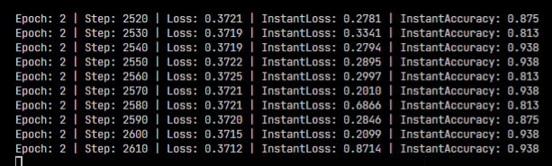

# NumSharpNetwork

A deep dive into neural networks.

Defining network in Numpy.NET. For more information, go to [this repository](https://github.com/zllz4/numpy-network)

## Screenshot

Convolution on MNIST:



## Purpose

- For education rather than for production.
- OOP-friendly and maintainable machine learning code.
- Reduce stupid errors before compile time.
- Prefer robust coding than less typing.

## Restriction

Currently Windows only.

## Run

Suppose the `pwd` is the root folder of the project.

```bash
cd src/NumSharpNetwork.Client
dotnet restore
dotnet run
```

## Notices

- `lossXXXXXGradient` indicates `d_loss / d_XXXXX`
- `lossXXXXXGradient.shape == XXXXX.shape` 

## Credit

- The origin/inspiring project - <https://github.com/zllz4/numpy-network>
- A good source of examples - <https://sgugger.github.io/a-simple-neural-net-in-numpy.html>

## Todo

- [ ] Add test cases for each layer
